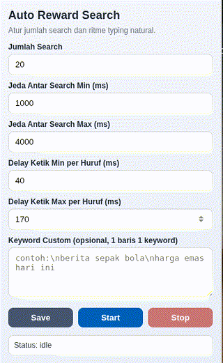

# AutoSearchReward

AutoSearchReward is a lightweight browser extension for Microsoft Edge/Chromium that automates Bing searches with adjustable timing, human-like typing simulation, and optional custom keyword lists.

This project is useful for testing search automation flows and learning how a Manifest V3 extension coordinates popup UI, background service worker, and content scripts.

## Preview

Preview image is optimized as GIF for lightweight repository display.

## Features

- Configurable number of searches per run
- Random delay between searches (min and max)
- Human-like typing delay per character (min and max)
- Optional custom keywords (one keyword per line)
- Start/Stop controls from popup
- Live status updates while running

## Tech Stack

- Manifest V3
- Background Service Worker
- Popup UI (HTML/CSS/JavaScript)
- `chrome.storage.sync`, `chrome.tabs`, and `chrome.scripting` APIs

## Project Structure

- `manifest.json`: Extension metadata, permissions, and entry points
- `background.js`: Main automation logic and runtime state
- `popup.html`: Extension popup markup
- `popup.css`: Popup styling
- `popup.js`: Popup interactions, settings, and status polling
- `rewards-notifier.js`: Content script for rewards page context

## Installation (Developer Mode)

1. Download or clone this repository.
2. Open Microsoft Edge and go to `edge://extensions`.
3. Enable `Developer mode`.
4. Click `Load unpacked`.
5. Select this project folder.
6. Pin the extension if needed.

You can also use Chrome by opening `chrome://extensions` and following the same steps.

## How To Use

1. Click the extension icon to open the popup.
2. Set your configuration:
   - `Jumlah Search` / Search count
   - `Jeda Antar Search Min/Max` / Delay between searches
   - `Delay Ketik Min/Max` / Typing delay per character
   - `Keyword Custom` (optional, one keyword per line)
3. Click `Save` to store settings.
4. Click `Start` to begin automation.
5. Click `Stop` anytime to request stop.

While running, the status area shows current progress and active query.

## Notes

- Keep timing values realistic to avoid unstable behavior.
- The extension opens Bing in a background tab and performs searches there.
- If Bing page structure changes, selector updates may be needed.

## Troubleshooting

- If status cannot update, close and reopen popup.
- If search input is not found, refresh Bing and try again.
- If extension does not run, re-check permissions in `manifest.json`.

## Disclaimer

Use this project responsibly and follow the terms of service of platforms you interact with. You are responsible for how you use this code.

## Bahasa Indonesia (Ringkas)

AutoSearchReward adalah extension ringan untuk Edge/Chromium yang membantu otomatisasi pencarian Bing dengan ritme yang bisa diatur supaya terlihat natural.

Cocok untuk:

- belajar alur extension Manifest V3
- eksperimen otomasi berbasis browser
- penggunaan dengan keyword custom

Cara pakai cepat:

1. Buka `edge://extensions`
2. Aktifkan `Developer mode`
3. `Load unpacked` dan pilih folder project ini
4. Buka popup extension
5. Atur jumlah search + delay
6. Klik `Start`

Kalau ada error, cek status di popup dan coba reload extension.

---

If this project helps you, feel free to fork and improve it.
